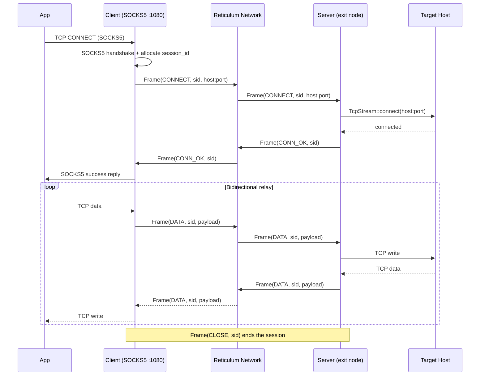

# rns-proxy

> **Disclaimer:** This project is relatively new and may have security issues especially when run as a server, make sure to firewall your network
> This project may be incompatiable with older versions of itself as it is still being currently developed

SOCKS5 proxy that tunnels TCP connections and UDP packets over the [Reticulum Network Stack](https://reticulum.network/). Route arbitrary TCP/UDP traffic through Reticulum's encrypted, delay-tolerant mesh network using the standard SOCKS5 protocol.

## How it works




The project consists of two main components:

- **Server** (exit node) -- registers on the RNS network, accepts incoming links, and proxies TCP connections to target hosts as well as forwarding UDP traffic
- **Client** (local proxy) -- runs a local SOCKS5 server, multiplexes all connections through a single encrypted RNS link to the server

As well as two additional wrappers around the socksv5 proxy:

- **Forward** (server) -- registers on the RNS network a socksv5 proxy that only accepts requests to the specified ports on localhost
- **Connect** (client) -- opens ports on localhost and forwards all traffic sent to the port to the reticulum server through a SOCKS5 proxy to that server's localhost ports, allowing non-SOCKS5 applications to work through reticulum pointing them at a localhost port.

All TCP and UDP sessions are multiplexed over one RNS link using a custom binary frame protocol. Frames larger than `LINK_MDU` are automatically chunked on send and reassembled on receive.

The client handles automatic reconnection when the link or underlying transport is lost, with exponential backoff and full RNS node recreation after repeated failures.


### UDP

Currently UDP is tunneled over the network using a link destination along with TCP, meaning that UDP is currently ordered and reliable unnecessarily which increases latency. This may be changed in the future.

## Build

### Cargo

```bash
cargo build --release
```

### Nix

```bash
nix build
# or enter dev shell:
nix develop
```

## Usage

### Prerequisites

A running Reticulum daemon (`rnsd`). Install via `pip install rns`.

```bash
rnsd
# or use the included example config:
./examples/run_rnsd.sh
```

### Start the server

On the exit node machine:

```bash
rns-proxy server
# or with a custom identity file:
rns-proxy server --identity-file /path/to/identity
```

On first run the server generates a new identity and saves it to `~/.reticulum/rns_proxy_identity`. On subsequent runs it loads the same identity, so the destination hash stays the same.

```
Server started. Client address:
  <32-hex-char-destination-hash>
```

### Start the client

On the local machine:

```bash
rns-proxy client -d <hash-from-server>
```

The client starts a SOCKS5 proxy:

```
SOCKS5 ready: 127.0.0.1:1080
```

To make the proxy accessible from other devices on the network:

```bash
rns-proxy client -d <hash-from-server> -l 0.0.0.0:1080
```

### Use it

Configure any application to use `127.0.0.1:1080` as a SOCKS5 proxy:

```bash
curl --socks5 127.0.0.1:1080 https://example.com
```

## CLI

```
rns-proxy [OPTIONS] <COMMAND>

Commands:
  server   Run the proxy server (exit node)
  client   Run the proxy client (local SOCKS5)

Options:
  --debug           Enable debug logging
  -V, --version     Print version
  -h, --help        Print help
```

**Server options:**

```
rns-proxy server [--identity-file <PATH>]
```

| Option | Default | Description |
|---|---|---|
| `--identity-file` | `~/.reticulum/rns_proxy_identity` | Path to the persistent identity file |

**Client options:**

```
rns-proxy client -d <HASH> [-l 127.0.0.1:1080]
```

| Option | Default | Description |
|---|---|---|
| `-d`, `--destination` | required | RNS destination hash (hex) |
| `-l`, `--listen` | `127.0.0.1:1080` | Local SOCKS5 listen address |

## Protocol

Multiplexed frame format (wire-compatible with the [Python implementation](https://github.com/rsgrinko/reticulum-socks5-proxy)):

```
[1 byte type][4 bytes session_id][2 bytes payload_len][payload]
```

| Type | Code | Description |
|---|---|---|
| CONNECT | `0x01` | Request connection to host:port |
| CONN_OK | `0x02` | Connection succeeded |
| CONN_ERR | `0x03` | Connection error (payload = UTF-8 reason) |
| DATA | `0x04` | Bidirectional data |
| CLOSE | `0x05` | Close session |
